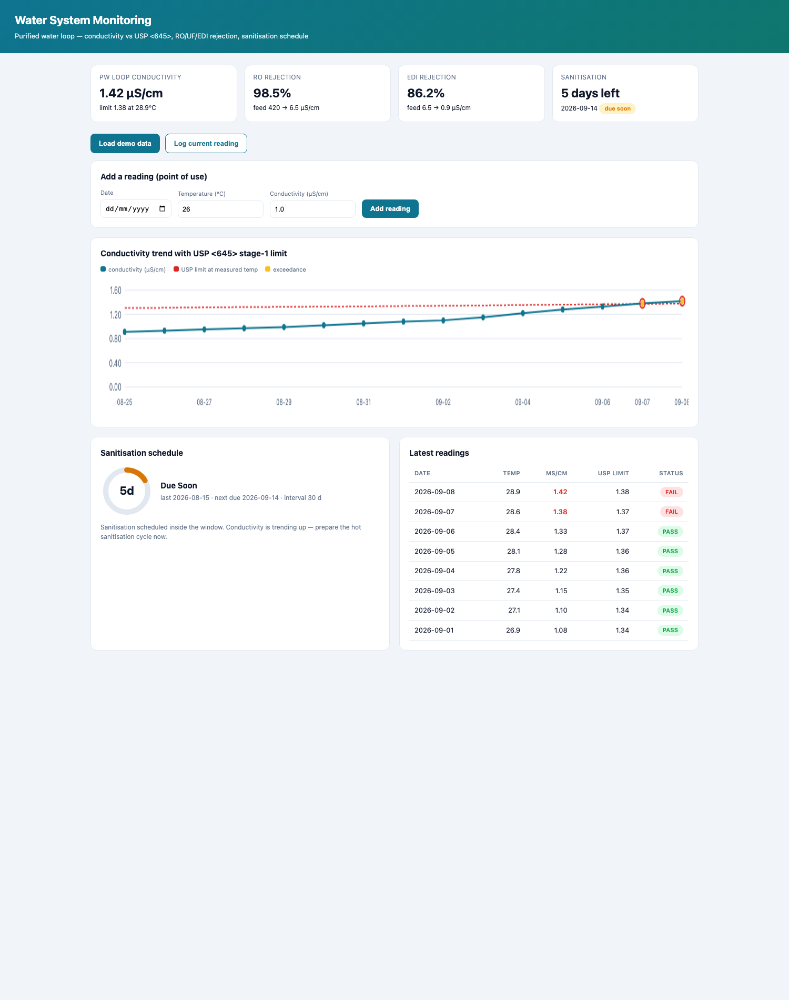

<div align="center">

# Water System Monitoring

**Purified-water loop monitoring for pharmaceutical manufacturing — conductivity vs the USP <645> stage-1 limit, RO/UF/EDI rejection, sanitisation schedule and trend charts**

The water that touches a pharmaceutical product runs through pre-treatment, RO,
UF, EDI and a hot / ambient purified-water distribution loop. This dashboard
keeps every stage honest and tells you *when to sanitise before* the loop fails
a point-of-use sample.

[](#)
[](#)
[](#)
[](#)
[](#)
[](https://marknwilliam.github.io/water-system-monitoring/)

</div>

---



## Why this exists

Water is the raw material used in the largest mass and touch every intermediate
and finish product. When the loop drifts, batches fail — and a failed batch
costs more than the whole water system. Two things catch drift early:

1. **Conductivity evaluated against the temperature-dependent USP limit**, not
   a single fixed number. Warmer water legitimately conducts more; evaluating
   at the measured temperature is what USP <645> stage 1 specifies.
2. **A sanitisation schedule that is actually current.** The loop lives on the
   cycle: sanitise → verify → operate → sanitise again.

## The method

### USP <645> stage-1 conductivity limit (µS/cm at measured °C)

```
 T °C   0   5  10  15  20  25  30  35  40  45  50  60  70  80  90 100
 µS/cm 0.6 0.8 0.9 1.0 1.1 1.3 1.4 1.5 1.7 1.8 2.1 2.4 2.7 3.1 3.6 4.1
```

The limit is interpolated between rows. A reading passes when
`measured µS/cm ≤ limit(temperature)`.

### Stage performance

```
Rejection %  = (1 − product/feed) × 100        (RO / UF / EDI)
Salt passage = 100 − rejection
```

### Sanitisation schedule

```
days_since = today − last sanitisation
days_left  = interval − days_since
→ overdue (< 0) · due soon (≤ 7) · in spec · done today
```

## What's in the repo

- **`water_monitoring.py`** — dependency-free library + CLI:
  `usp_conductivity_limit()`, `passes_usp()`, `rejection_pct()`,
  `salt_passage_pct()`, `sanitization_status()`, `series_stats()`, and a
  30-reading demo series that trends into an exceedance over two weeks —
  exactly the "prepare to sanitise" moment the dashboard is for.
- **`test_water_monitoring.py`** — 17 unit tests: table points, interpolation,
  clamping, rejection math, the full sanitisation state machine and the demo
  exceedance pattern.
- **`index.html`** — standalone dashboard: conductivity trend with the USP
  limit overlaid (red dashes), exceedance markers, stage KPI cards,
  sanitisation countdown ring and a point-of-use log form.

## Quick start

```bash
# web dashboard
open index.html

# CLI
python3 water_monitoring.py

# library
python3 -c "
import water_monitoring as wm
print('limit @27C =', wm.usp_conductivity_limit(27))
print('55C/3.5uS passes:', wm.passes_usp(55, 3.5))
print('RO rejection:', f\"{wm.rejection_pct(420, 6.5):.1f}%\")"

# tests
python3 -m unittest test_water_monitoring -v
```

## Example output

```
Sanitisation: last 2026-08-15, DUE SOON, 5 days left (next due 2026-09-14)

  T=25.0C cond=0.9 uS/cm  limit=1.30  PASS
  T=27.0C cond=1.2 uS/cm  limit=1.34  PASS
  T=25.0C cond=1.45 uS/cm limit=1.30  FAIL <645>

RO rejection: 98.5%
EDI rejection: 86.2%
```

## Repository layout

```
water-system-monitoring/
├── index.html                # monitoring dashboard (open this)
├── water_monitoring.py       # library + CLI
├── test_water_monitoring.py  # unit tests
├── docs/        # README preview screenshot
└── README.md
```

## License

MIT.